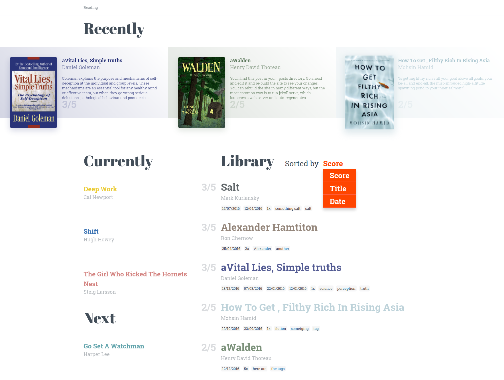
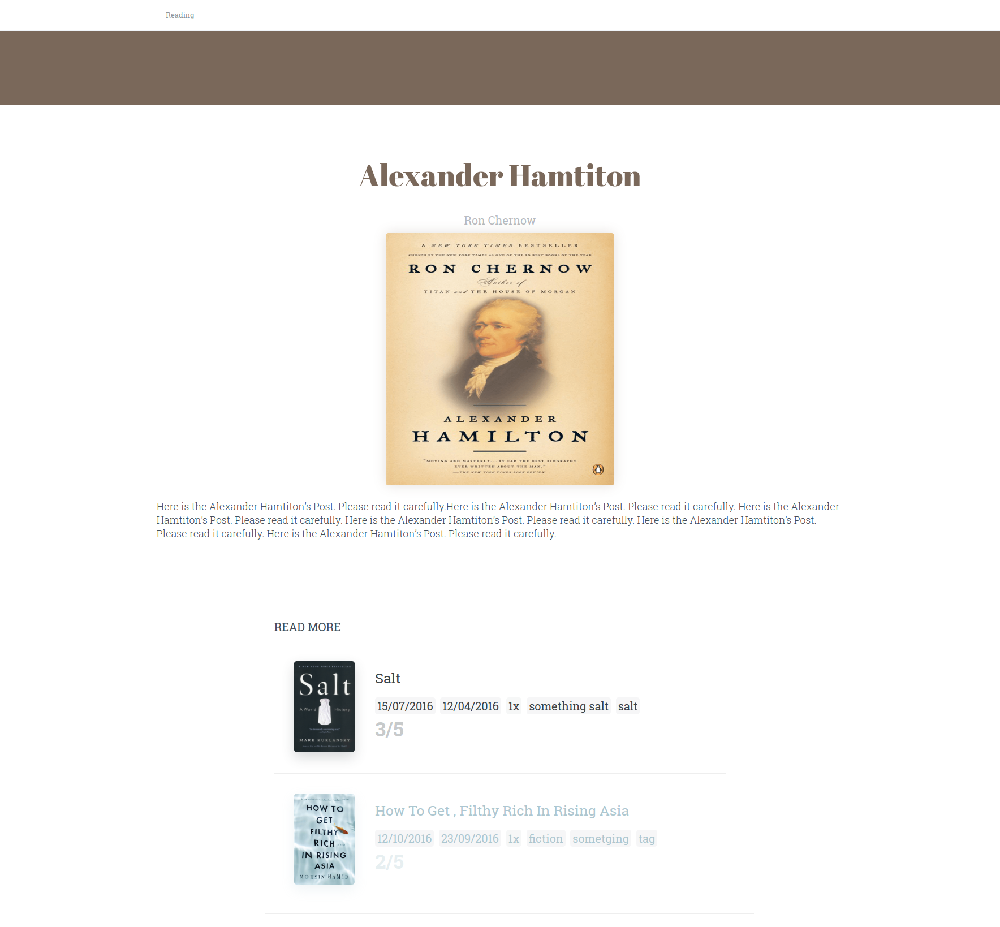

# jekyll-book-reading-ruby
Simple Jekyll site for reading book post with Ruby.

### Index Page 


### Post Detail page



## Run Instruction
```
git clone https://github.com/meandevstar/jekyll-book-reading-ruby.git
cd jekyll-book-reader
gem install jekyll
```

Check if jekyll gem is installed
```
jekyll -v
```

Run static server
```
jekyll serve
```
